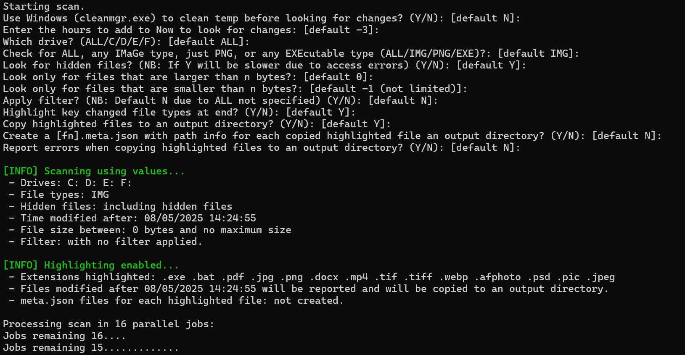

# scanforchangeshours_fv2

**PowerShell scripts to search for files changed on all, or a single, local drive within the last X hours using multiple threads.**

## Purpose

Useful when diagnosing system changes or locating lost files.  
Scenarios include:

- You just saved a file and can't find it.
- You did an install and can't find the package location.
- You are seeing a fault on your system but have not changed anything.
- Checking if a virus or unknown application installed a file.
- Understanding which files are being writting to verbosely (Adoble I'm looking at you)

The script can search for different file types and provides these functions:

### Core Functions

1. **List Changed Files**  
   List all files changed on all (or specified) drives in the last X hours. Writes results to a file in the output directory.

2. **Highlight & Copy Important Files**  
   For "highlighted" file types (pre-defined), copies changed files to an output directory for inspection.

   - Output directory: created in your Downloads folder, begins with `sfc-`
   - Optionally: for every copied file, generates a `[filename].meta.json` file with the original location.
  
## Example script run


      --snip--

## Usage Notes

The script will ask for all the options, or they can be passed as switches on the command line. They are:

| Parameter                  | Description |
|----------------------------|-------------|
| `-ModDefault`              | `Y` means the parameter **modifies the default value**, rather than setting it. Default: `N`. |
| `-CleanTempFiles`          | `Y` to run **Windows Disk Cleanup (cleanmgr.exe)** before scanning. Default: `N`. |
| `-HoursToCheck`            | Number of **hours to look back** for changes. Must be negative. Can be a fraction, e.g. -0.5 for 30mins. Default: `-3`. |
| `-WhichDrive`              | Specify the **drive letter** to scan, e.g. `C` or `ALL` to scan all drives. Default: `ALL`. |
| `-CheckFor`                | `File groups` to check for: `ALL`, `IMG`, `EXT`, `EXE`. Default: `ALL`. |
| `-CheckForExt`             | A specific extension (no '.') to check for. Prompted for if `CheckFor` is `EXT`. Default `png` |
| `-CheckHidden`             | `Y` to include **hidden files** in the scan (may be slower). Default: `'N'`. |
| `-CheckForSizeMin`         | Minimum file size (in bytes) to include. Default: `0` (no minimum). |
| `-CheckForSizeMax`         | Maximum file size (in bytes) to include. Default: `-1` (no limit). |
| `-FilterApp`               | `Y` to apply built-in filters to reduce noise. Default: `'Y'` if `CheckFor` is `ALL`, otherwise `N`. |
| `-ShowHighlights`          | `Y` to **highlight key changed file types** at the end of the scan. Default: `Y`. |
| `-CopyHighlights`          | `Y` to **copy highlighted files** to a temporary folder in the Downloads directory. Default is `N` if CheckFor is ALL|
| `-CopyMetaInfo`            | `Y` to create a `.meta.json` file with path/info for each copied file. Default is `N` if CheckFor is ALL|
| `-CopyReportErrors`        | `Y` to **log copy errors** during the highlight operation into the results file. Default is `N`|

`File groups` are sets of extensions not an actual extensions
| Parameter | Extensions  |
|-----------|-------------|
| `ALL`     | all extensions |
| `IMG`     | BMP, GIF, JPG, JPEG, PNG, TIF, TIFF, ICO, DDS, MP4, MOV, WEBM, AVI, WMV, WEBP, AFPHOTO, PSD, PIC |
| `EXE`     | BAT, PS1, BIN, CMD, COM, CPL, EXE, GADGET, INF1, INS, INX, ISU, JOB, JSE, LNK, MSC, MSI, MSP, MST, PAF, PIF, PS1, REG, RGS, SCR, SCT, SHB, SHS, U3P, VB, VBE, VBS, VBSCRIPT, WS, WSF, WSH |
| `EXT`     | A single extension to look for as defined in `CheckForExt`. Do not include the `'.'` prefix when specifing  `CheckForExt`. |

### Example 1 - will run with no prompting

`powershell -File '.\scanforchangeshours_fv2.ps1' `
  `-CleanTempFiles N `
  `-HoursToCheck -3 `
  `-WhichDrive ALL `
  `-CheckFor ALL `
  `-CheckHidden Y `
  `-CheckForSizeMin 0 `
  `-CheckForSizeMax -1 `
  `-FilterApp Y `
  `-ShowHighlights Y `
  `-CopyHighlights N `
  `-CopyMetaInfo N `
  `-CopyReportErrors N`

### Example 2 - run with prompting but change one of the defaults

`powershell -File '.\scanforchangeshours_fv2.ps1' `
 `-ModDefault Y `
 `-CheckFor IMG `

### Beware

> After Win11 H2 update, PowerShell scripts may not run by default.  
> You must open a PowerShell terminal to run scripts with bypassed execution policy, or use a batch file or Visual Studio Code.

```
powershell -ExecutionPolicy ByPass -File .\scanforchangeshours_fv2.ps1
```
### Additional Notes

- **Processing Hidden Files:** Script can be up to 3x slower when including hidden files, especially if not running as admin (access denied errors).
- **Result Folders:** If you run the script multiple times without deleting previous results, the output may be scanned again. This is intentional.
- **PowerShell Version:** Only works reliably with **PowerShell 5.1**, due to threading issues in 7.x.  
  Check your version with:
  ```powershell
  Write-Host $($PSVersionTable.PSVersion)
  ```
- See the top of the scanforchangeshours_fv2.ps1  for more notes.

## Update History

- **2025-08-05:** Initial version

## License

> Licensed under: As specified in git repo - CC0-1.0 license
> This software is provided 'as-is', without any expressed or implied warranty. In no event will the author be held liable for any damages arising from the use of this software. This holds true overtop of any statements in the license.
